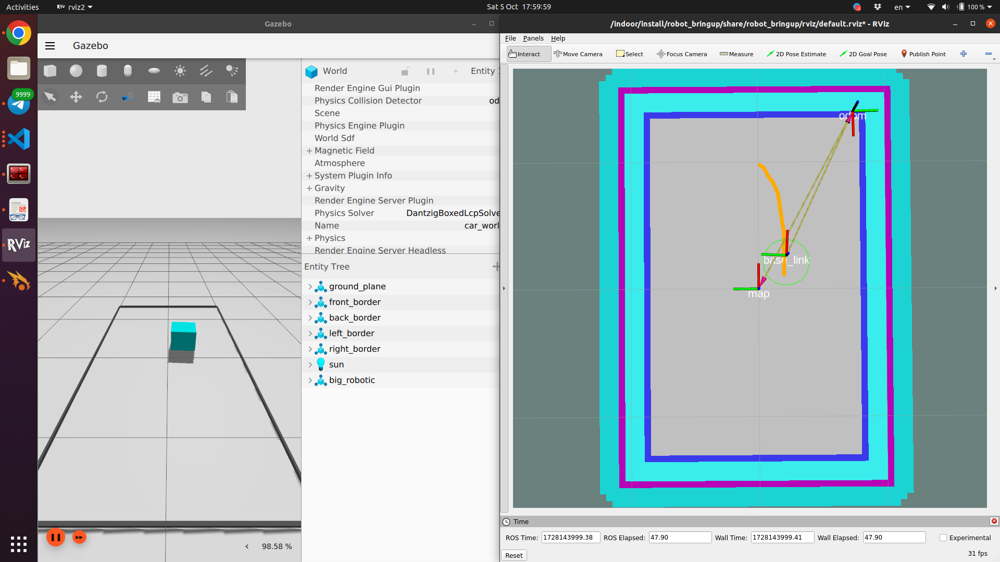

Start simulator
```
ros2 launch simulator_bringup simulator_launch.py
```

Set robot move forward 1 m/s
```
ros2 topic pub --once /robot/control/cmd_vel geometry_msgs/msg/Twist "{linear: {x: 1.0, y: 0.0, z: 0.0}, angular: {x: 0.0, y: 0.0, z: 0.0}}"
```

Set robot stop movement
```
ros2 topic pub --once /robot/control/cmd_vel geometry_msgs/msg/Twist "{linear: {x: 0.0, y: 0.0, z: 0.0}, angular: {x: 0.0, y: 0.0, z: 0.0}}"
```


